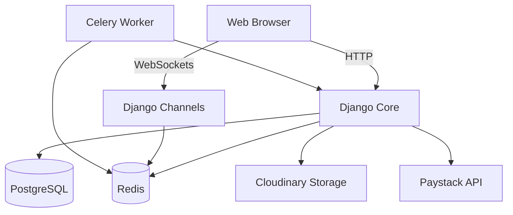

# Vellon System Architecture

This document provides a high-level overview of the Vellon technical architecture, data flow, and core components.

## 🏗️ System Overview

Vellon is built as a monolithic Django application with modular apps, leveraging modern asynchronous components for real-time features and background processing.

## 📱 Core Modules

### 1. Accounts (`accounts/`)
- **Custom User Model**: Extends `AbstractUser` to support multiple roles (Customer, Merchant, Admin).
- **Authentication**: Integrated with `django-allauth` for robust signup, login, and password management.
- **Profiles**: Extended metadata for users, including shipping addresses and merchant details.

### 2. Stores (`stores/`)
- **Multi-vendor Logic**: Each merchant has a unique store profile.
- **Verification**: Logic for verifying stores before they go live.
- **Storefronts**: Dynamic generation of store-specific pages.

### 3. Products (`products/`)
- **Catalog**: Hierarchical categories and attribute-based product management.
- **Inventory**: Real-time stock tracking and updates.
- **Media**: Integration with Cloudinary for optimized image delivery.

### 4. Orders & Payments (`orders/`, `payments/`)
- **Checkout Flow**: Multi-step process from cart to payment.
- **Paystack Integration**: Server-to-server verification of transactions.
- **Fulfillment**: State machine for tracking order status (Pending, Paid, Shipped, Delivered, Cancelled).

### 5. Real-time Engine (`messaging/`, `notifications/`, `channels`)
- **WebSockets**: Real-time bidirectional communication using `daphne` and `channels_redis`.
- **Chat System**: Secure, instant messaging between buyers and sellers.
- **Push Notifications**: Live updates for order status and new messages.

## ⚙️ Background Processing

We use **Celery** with **Redis** as a broker to handle time-consuming tasks:
- **Email Delivery**: Welcome emails, order confirmations, and password resets.
- **Media Optimization**: Post-upload processing for images.
- **Periodic Tasks**: Using `django-celery-beat` for automated cleanup and reporting.

## 🔐 Security & Performance

- **Environment Management**: `python-decouple` for separating secrets from code.
- **Static Asset Delivery**: `WhiteNoise` for efficient serving of static files.
- **Error Tracking**: `Sentry` for real-time exception monitoring in production.
- **Database Optimization**: Strategic indexing and use of `select_related`/`prefetch_related` to minimize queries.

## 🚀 Deployment

The system is designed to be deployed using:
- **Web Server**: Gunicorn (HTTP) & Daphne (ASGI/WebSockets).
- **Reverse Proxy**: Nginx.
- **Infrastructure**: Optimized for platforms like Heroku, DigitalOcean, or AWS.
